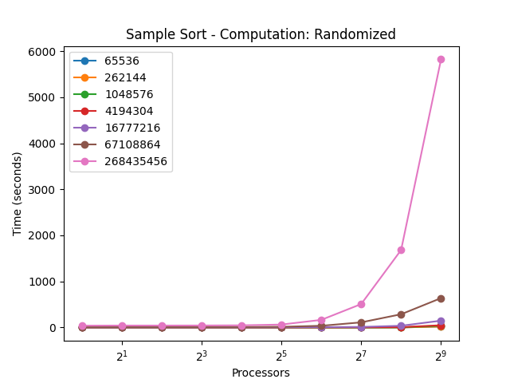

# CSCE 435 Group project

## 0. Group number: 24

## 1. Group members:
1. Jos Sebastian
2. Jackson Stone
3. Chase Fletcher
4. Ryan Swetonic

## 2. Project topic (e.g., parallel sorting algorithms)
The topic of this project is the implementation, evaluation, and analysis of various parallel sorting algorithms and how they will behave in various situations with differing problems sizes, number of available processors, and levels of sorting completion.

## 3. Communication
The main method of communication for this group project will be through Slack.

### 2a. Brief project description (what algorithms will you be comparing and on what architectures)

- Bitonic Sort:
    Each process is given an equal (or as close to equal as possible) amount of data which is sorted locally. The processes are then paired up in a network log_2(n) times and merged into bitonic sequences, until on the final merge they are merged into a sorted sequence.

- Sample Sort:
    Sample sort sorts datasets by following steps. First, random samples are selected and sorted to create defined buckets. Next, elements from the original dataset are assigned to these buckets based on their values, and each bucket is then sorted independently. Finally, the sorted buckets are merged to produce the fully sorted dataset.

- Merge Sort:
    First, each processor sequentially sorts its data. Then, arrays are merged 2 at a time, keeping them sorted. This continues until all data is merged into one array.

- Radix Sort:
    Radix sort sorts arrays of numbers by comparing them digit-by-digit. It begins
    with the least significant digit, and groups numbers into buckets based on
    their current digit. This process repeats for all digits, until the number
    with the most digits is fully sorted across all processes.

### 2b. Pseudocode for each parallel algorithm

#### Sample Sort
```
function Start(process, processes, size, type, subsize, subtype, subarray, sorted):
    subsize = size / processes
    subtype = type
    initialize subarray with size subsize

    if type == 0:
        for index from 0 to subsize - 1:
            subarray[index] = (process * subsize) + index

    else if type == 1:
        for index from 0 to subsize - 1:
            subarray[index] = (process * subsize) + index
        if process == 0:
            perturb = min(0.005 * size, subsize)
            for index from 0 to perturb - 1:
                subarray[index] = (processes * subsize) - ((process * subsize) + index + 1)
        else if process == processes - 1:
            perturb = min(0.005 * size, subsize)
            for index from 0 to perturb - 1:
                subarray[subsize - index - 1] = index

    else if type == 2:
        for index from 0 to subsize - 1:
            subarray[index] = random number between 0 and size

    else if type == 3:
        for index from 0 to subsize - 1:
            subarray[index] = (processes * subsize) - ((process * subsize) + index + 1)

function End(process, processes, size, type, subsize, subtype, subarray, sorted):
    sort_status = is_sorted(subarray)

    bucket = size of subarray
    buckets = array of size processes
    MPI_Gather(bucket to buckets from all processes)
    MPI_Bcast buckets to all processes

    left = find left neighbor with non-zero bucket
    right = find right neighbor with non-zero bucket

    if bucket is not zero and left and right are not both -1:
        if left == -1:
            l = last element of subarray
            r = receive from right
            sort_status = sort_status AND (l <= r)
        else if right == -1:
            r = first element of subarray
            send r to left
        else:
            send r to left
            l = last element of subarray
            r = receive from right
            sort_status = sort_status AND (l <= r)

    global_status = AND of sort_status from all processes
    sorted = global_status

function main(argc, argv):
    if argc != 3:
        print usage message and exit

    size = 2 raised to power of atoi(argv[1])
    type = atoi(argv[2])

    initialize MPI and get process and total number of processes

    start timing
    if process == MASTER:
        print "Sample Sort: Size" and "Type"

    initialize subsize, subtype, and subarray
    Start(process, processes, size, type, subsize, subtype, subarray, sorted)

    sort subarray

    gather candidates for sampling from all processes
    sort candidates

    find splitters and broadcast to all processes

    initialize buckets
    distribute elements into buckets based on splitters

    subarray = bucket of current process
    exchange buckets between processes and merge

    End(process, processes, size, type, subsize, subtype, subarray, sorted)

    if process == MASTER:
        print result of sort and time taken

    finalize MPI

```

#### Merge Sort
```
Main:
    Perform sequential sort on each processor

    merging_arrays = 2
    p = processor rank

    while merging_arrays <= num_procs:
        if p % merging_arrays == 0:
            receive from (p + (merging_arrays/2))
            mergeArrays
        if p % merging_arrays == merging_arrays/2:
            send to (p - (merging_arrays/2))
        merging_arrays *= 2

mergeArrays:
	while there are elements unadded in both input arrays:
		append smallest element from input arrays to output array
		advance past element added
	Append remaining elements from one array
	Return output array
```

#### Bitonic Sort
```
main() {
  MASTER, UP = 0
  DOWN = 1

  MPI_Status status;

  n = number of elements to be sorted

  MPI_Init()

  MPI_Comm_rank(MPI_COMM_WORLD, &taskid);
  MPI_Comm_size(MPI_COMM_WORLD, &numtasks);

  if numtasks is not a power of 2:
    return 1

  n_each = n / numtasks

  local_data = empty array of size n_each

  if taskid == 0:
    A = array of elements to be sorted

  MPI_Scatter(a, n_each, MPI_INT, local_data, n_each, MPI_INT, 0, MPI_COMM_WORLD) // scatter an equal amount of the data among all processes

  // Sort this processes data in UP direction
  bitonic_up(local_data, n_each)

  // Parallel sort
  log_numtasks = log_2(numtasks)
  for (s = 0; s < log_numtasks; s++) {
    for (t = s; t >= 0; t--) {
      // Determine partner
      partner_task = taskid ^ (1 << t)

      // Determine direction based on bit at s + 1 in taskid
      direction = UP if ((taskid >> (s + 1)) mod 2 == 0) else DOWN

      // Data exchange with partner
      partner_data = empty array of size n_each
      if (taskid > partner_task) {
        MPI_Send(local_data, n_each, MPI_INT, partner_task, 0, MPI_COMM_WORLD, status)
        MPI_Recv(partner_data, n_each, MPI_INT, partner_task, 0 , MPI_COMM_WORLD, status)
      } else {
        MPI_Recv(partner_data, n_each, MPI_INT, partner_task, 0 , MPI_COMM_WORLD, status)
        MPI_Send(local_data, n_each, MPI_INT, partner_task, 0, MPI_COMM_WORLD, status)
      }

      // Combine data with partner
      merged = merge(local_data, partner_data, direction)

      // Split data with partner
      if direction == UP and taskid < partner or direction == DOWN and rank > partner {
        copy(merged, merged + n_each - 1, local_data)
      } else {
        copy(merged + n_each, merged + n_each * 2 - 1, local_data)
      }
    }
  }

  // Collect data
  MPI_Gather(local_data, n_each, MPI_INT, A, n_each, MPI_INT, 0, MPI_COMM_WORLD)

  // Output
  if taskid == 0 {
    output A
  }

  MPI_Finalize()
}
```

#### Radix Sort
```
p = number of processes
array = inputted array to be sorted
n = problem size
max_digit = maximum number of digits in largest number

id = Process ID
master_process = 0
worker_processes = [1, 2, 3, ..., p - 1]

if id == master_process:
    chunk_size = n / p
    for index, process in worker_processes:
        start = index * chunk_size
        end = (index + 1) * chunk_size
        Send(array[start:end], to=process)

else if id is in worker_process:
    local_array = Receive(from=master_process)

    for exp in range(1, max_digit):

        buckets = ten empty arrays inside a big array
        for number in local_array:
            digit = (number // exp) % 10
            buckets[digit].append(number)

        for i in range(10):
            Send(buckets[i], to=all_other_processes)
            Receive(buckets[i], from=all_other_processes)

        local_array = concatenate(buckets)

    Send(local_array, to=master_process)

if id == master_process:
    for process in worker_processes:
        sorted_chunk = Receive(from=process)
        Append sorted_chunk to the final sorted array

```


### 2c. Evaluation plan - what and how will you measure and compare
- Input Sizes, Input Types, Processes

    - Input Sizes: 2^16, 2^18, 2^20, 2^22, 2^24, 2^26, 2^28

    - Input Types: Sorted, Sorted with 1% Perturbed, Random, Reverse Sorted

    - Processes: 2, 4, 8, 16, 32, 64, 128, 256, 512, 1024

- Strong scaling (same problem size, increase number of processors/nodes)
- Weak scaling (increase problem size, increase number of processors)

### 3a. Caliper instrumentation
Please use the caliper build `/scratch/group/csce435-f24/Caliper/caliper/share/cmake/caliper`
(same as lab2 build.sh) to collect caliper files for each experiment you run.

Your Caliper annotations should result in the following calltree
(use `Thicket.tree()` to see the calltree):
```
main
|_ data_init_X      # X = runtime OR io
|_ comm
|    |_ comm_small
|    |_ comm_large
|_ comp
|    |_ comp_small
|    |_ comp_large
|_ correctness_check
```

Required region annotations:
- `main` - top-level main function.
    - `data_init_X` - the function where input data is generated or read in from file. Use *data_init_runtime* if you are generating the data during the program, and *data_init_io* if you are reading the data from a file.
    - `correctness_check` - function for checking the correctness of the algorithm output (e.g., checking if the resulting data is sorted).
    - `comm` - All communication-related functions in your algorithm should be nested under the `comm` region.
      - Inside the `comm` region, you should create regions to indicate how much data you are communicating (i.e., `comm_small` if you are sending or broadcasting a few values, `comm_large` if you are sending all of your local values).
      - Notice that auxillary functions like MPI_init are not under here.
    - `comp` - All computation functions within your algorithm should be nested under the `comp` region.
      - Inside the `comp` region, you should create regions to indicate how much data you are computing on (i.e., `comp_small` if you are sorting a few values like the splitters, `comp_large` if you are sorting values in the array).
      - Notice that auxillary functions like data_init are not under here.
    - `MPI_X` - You will also see MPI regions in the calltree if using the appropriate MPI profiling configuration (see **Builds/**). Examples shown below.

All functions will be called from `main` and most will be grouped under either `comm` or `comp` regions, representing communication and computation, respectively. You should be timing as many significant functions in your code as possible. **Do not** time print statements or other insignificant operations that may skew the performance measurements.

### **Nesting Code Regions Example** - all computation code regions should be nested in the "comp" parent code region as following:
```
CALI_MARK_BEGIN("comp");
CALI_MARK_BEGIN("comp_small");
sort_pivots(pivot_arr);
CALI_MARK_END("comp_small");
CALI_MARK_END("comp");

# Other non-computation code
...

CALI_MARK_BEGIN("comp");
CALI_MARK_BEGIN("comp_large");
sort_values(arr);
CALI_MARK_END("comp_large");
CALI_MARK_END("comp");
```

### **Calltree Example**:
```
# MPI Mergesort
4.695 main
├─ 0.001 MPI_Comm_dup
├─ 0.000 MPI_Finalize
├─ 0.000 MPI_Finalized
├─ 0.000 MPI_Init
├─ 0.000 MPI_Initialized
├─ 2.599 comm
│  ├─ 2.572 MPI_Barrier
│  └─ 0.027 comm_large
│     ├─ 0.011 MPI_Gather
│     └─ 0.016 MPI_Scatter
├─ 0.910 comp
│  └─ 0.909 comp_large
├─ 0.201 data_init_runtime
└─ 0.440 correctness_check
```
### Sample Sort Calltree
```
1.054 main
├─ 0.000 MPI_Comm_dup
├─ 0.000 MPI_Finalize
├─ 0.000 MPI_Finalized
├─ 0.000 MPI_Init
├─ 0.000 MPI_Initialized
├─ 0.006 comm
│  ├─ 0.003 comm_large
│  │  ├─ 0.001 MPI_Recv
│  │  ├─ 0.000 MPI_Send
│  │  └─ 0.003 comp
│  │     └─ 0.003 comp_large
│  └─ 0.002 comm_small
│     ├─ 0.001 MPI_Bcast
│     └─ 0.001 MPI_Gather
├─ 0.025 comp
│  ├─ 0.025 comp_large
│  └─ 0.000 comp_small
├─ 0.005 correctness_check
│  ├─ 0.000 MPI_Bcast
│  ├─ 0.004 MPI_Gather
│  ├─ 0.000 MPI_Recv
│  ├─ 0.000 MPI_Reduce
│  └─ 0.000 MPI_Send
└─ 0.005 data_init_runtime
```

### Bitonic Sort Calltree
```
15.162 main
├─ 0.018 MPI_Comm_dup
├─ 0.000 MPI_Finalize
├─ 0.000 MPI_Finalized
├─ 0.000 MPI_Init
├─ 0.000 MPI_Initialized
├─ 0.213 comm
│  ├─ 0.107 MPI_Barrier
│  └─ 0.104 comm_large
│     ├─ 0.066 MPI_Recv
│     └─ 0.035 MPI_Send
├─ 2.386 comp
│  ├─ 2.275 comp_large
│  └─ 0.108 comp_small
├─ 0.031 correctness_check
│  ├─ 0.000 MPI_Recv
│  └─ 0.001 MPI_Send
└─ 0.063 data_init_local
```

### Merge Sort Calltree
```
0.390 main
├─ 0.000 MPI_Init
├─ 0.000 data_init_local
├─ 0.004 comp
│  ├─ 0.003 comp_large
│  └─ 0.003 comp_small
├─ 0.002 comm
│  └─ 0.002 comm_large
│     ├─ 0.004 MPI_Recv
│     └─ 0.000 MPI_Send
├─ 0.000 correctness_check
├─ 0.000 MPI_Finalize
├─ 0.000 MPI_Initialized
├─ 0.000 MPI_Finalized
└─ 0.014 MPI_Comm_dup
```

### Radix Sort Calltree
```
1.960 main
├─ 0.000 MPI_Init
├─ 0.214 data_distribution
│  └─ 0.214 MPI_Scatter
├─ 0.058 local_sort
├─ 0.028 data_gathering
│  └─ 0.028 MPI_Gather
├─ 0.005 final_merge
├─ 0.000 MPI_Finalize
├─ 0.125 correctness_check
├─ 0.000 MPI_Initialized
├─ 0.000 MPI_Finalized
└─ 0.168 MPI_Comm_dup
```

### 3b. Collect Metadata

Have the following code in your programs to collect metadata:
```
adiak::init(NULL);
adiak::launchdate();    // launch date of the job
adiak::libraries();     // Libraries used
adiak::cmdline();       // Command line used to launch the job
adiak::clustername();   // Name of the cluster
adiak::value("algorithm", algorithm); // The name of the algorithm you are using (e.g., "merge", "bitonic")
adiak::value("programming_model", programming_model); // e.g. "mpi"
adiak::value("data_type", data_type); // The datatype of input elements (e.g., double, int, float)
adiak::value("size_of_data_type", size_of_data_type); // sizeof(datatype) of input elements in bytes (e.g., 1, 2, 4)
adiak::value("input_size", input_size); // The number of elements in input dataset (1000)
adiak::value("input_type", input_type); // For sorting, this would be choices: ("Sorted", "ReverseSorted", "Random", "1_perc_perturbed")
adiak::value("num_procs", num_procs); // The number of processors (MPI ranks)
adiak::value("scalability", scalability); // The scalability of your algorithm. choices: ("strong", "weak")
adiak::value("group_num", group_number); // The number of your group (integer, e.g., 1, 10)
adiak::value("implementation_source", implementation_source); // Where you got the source code of your algorithm. choices: ("online", "ai", "handwritten").
```
#### Sample
```json
{
    "algorithm": "Sample Sort",
    "programming_model": "mpi",
    "data_type": "int",
    "size_of_data_type": 4,
    "input_size": 65536,
    "input_type": "Random",
    "num_procs": 32,
    "scalability": "strong",
    "group_num": 24,
    "implementation_source": "handwritten"
}
```
#### Bitonic
```json
{
    "algorithm": "bitonic",
    "programming_model": "mpi",
    "data_type": "int",
    "size_of_data_type": "4",
    "input_size": "4194304",
    "num_procs": "16",
    "scalability": "strong",
    "group_num": "24",
    "implementation_source": "online"
}
```
#### Merge sort
```json
{
    "algorithm": "merge",
    "programming_model": "mpi",
    "data_type": "int",
    "size_of_data_type": "4",
    "input_size": "65536",
    "num_procs": "4",
    "scalability": "strong",
    "group_num": "24",
    "implementation_source": "handwritten"
}
```
#### Radix sort
```json
{
    "algorithm": "radix_sort",
    "programming_model": "mpi",
    "data_type": "int",
    "size_of_data_type": 4,
    "input_size": 16777216,
    "input_type": "Random",
    "num_procs": 64,
    "scalability": "strong",
    "group_num": 24,
    "implementation_source": "handwritten"
}
```
They will show up in the `Thicket.metadata` if the caliper file is read into Thicket.

### **See the `Builds/` directory to find the correct Caliper configurations to get the performance metrics.** They will show up in the `Thicket.dataframe` when the Caliper file is read into Thicket.
## 4. Performance evaluation

Include detailed analysis of computation performance, communication performance.
Include figures and explanation of your analysis.

### 4a. Vary the following parameters
For input_size's:
- 2^16, 2^18, 2^20, 2^22, 2^24, 2^26, 2^28

For input_type's:
- Sorted, Random, Reverse sorted, 1%perturbed

MPI: num_procs:
- 2, 4, 8, 16, 32, 64, 128, 256, 512, 1024

This should result in 4x7x10=280 Caliper files for your MPI experiments.

### 4b. Hints for performance analysis

To automate running a set of experiments, parameterize your program.

- input_type: "Sorted" could generate a sorted input to pass into your algorithms
- algorithm: You can have a switch statement that calls the different algorithms and sets the Adiak variables accordingly
- num_procs: How many MPI ranks you are using

When your program works with these parameters, you can write a shell script
that will run a for loop over the parameters above (e.g., on 64 processors,
perform runs that invoke algorithm2 for Sorted, ReverseSorted, and Random data).

### 4c. You should measure the following performance metrics
- `Time`
    - Min time/rank
    - Max time/rank
    - Avg time/rank
    - Total time
    - Variance time/rank

### Sample Sort


_1%_Pertrubed.png)
_Randomized.png)
_Reverse_Sorted.png)
_Sorted.png)





## 5. Presentation
Plots for the presentation should be as follows:
- For each implementation:
    - For each of comp_large, comm, and main:
        - Strong scaling plots for each input_size with lines for input_type (7 plots - 4 lines each)
        - Strong scaling speedup plot for each input_type (4 plots)
        - Weak scaling plots for each input_type (4 plots)

Analyze these plots and choose a subset to present and explain in your presentation.

## 6. Final Report
Submit a zip named `TeamX.zip` where `X` is your team number. The zip should contain the following files:
- Algorithms: Directory of source code of your algorithms.
- Data: All `.cali` files used to generate the plots seperated by algorithm/implementation.
- Jupyter notebook: The Jupyter notebook(s) used to generate the plots for the report.
- Report.md
